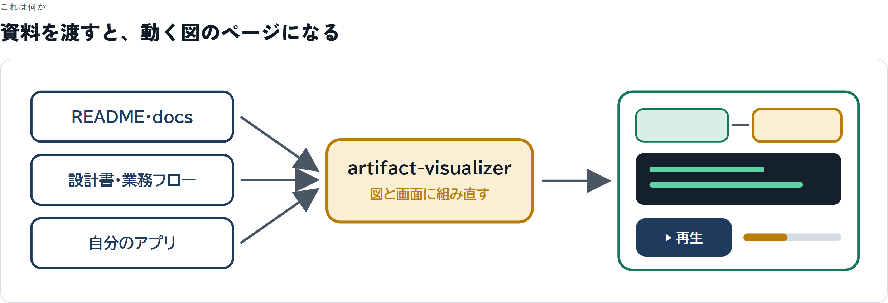
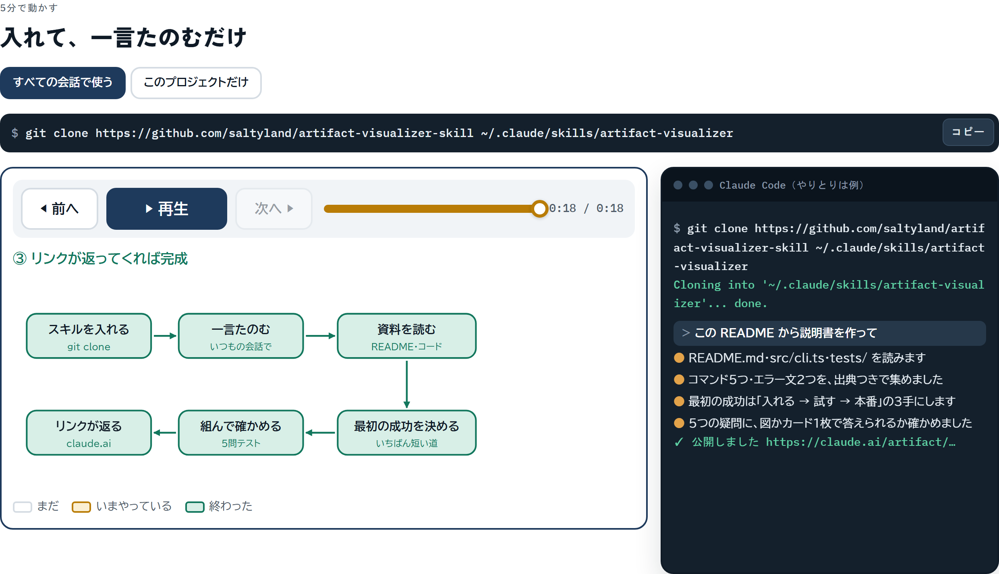
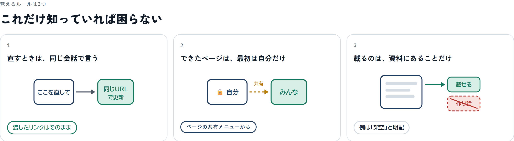
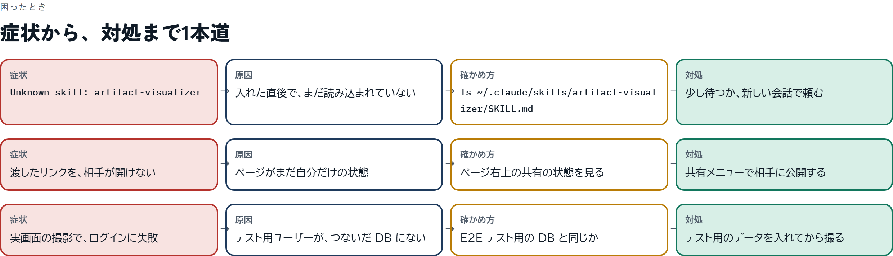

# Artifact Visualizer Skill

**読まなくても、見れば分かるページを作る Claude Code / Claude 用スキル。**
README を渡すだけで「世界一わかりやすい説明書」も作れます。



> A skill for Claude that builds white-based, diagram-first, animated HTML pages. Press ▶ and watch one thing change at a time. It also turns a README, docs, or a codebase into an easy-to-follow manual.



| 覚えるルールは3つ | 困ったときは症状から1本道 |
|---|---|
|  |  |

<sub>上の画像は、このスキル自身の説明書モードで、この README と SKILL.md から作ったページのスクリーンショットです。</sub>

## 何ができるか

| モード | 渡すもの | できるもの |
|---|---|---|
| **説明モード** | 設計書・業務フロー・提案・方針 | 図と画面の再現が並び、▶ で1ステップずつ動く説明ページ |
| **説明書モード** | README・docs・`--help`・リポジトリ | 「5分で最初の成功」までを動画のように見せる説明書 |

説明書モードは、こういう順番でページを作ります。

1. **これは何か** … 入力 → 処理 → 出力を1枚の図で
2. **5分で動かす** … ターミナル／画面の再現と図が同期して、1行ずつ進む
3. **覚えるルールは3つ** … 壊さないために必要なことだけ
4. **よくある使い方** … やりたいことから選べるレシピ
5. **困ったとき** … エラーの文言 → 原因 → 確かめ方 → 対処
6. **設定一覧・FAQ・次の一歩**

公開前に「どう入れる？」「最初に何を打つ？」「成功したらどう見える？」「どう戻す？」「エラーはどこを見る？」の5問に、図かカード1枚で答えられるかを確かめます。

見本は [`assets/template-manual.html`](assets/template-manual.html)（架空の CLI `photosort` の説明書）です。

## インストール

Claude Code の場合、スキルのフォルダに clone します。

```bash
git clone https://github.com/saltyland/artifact-visualizer-skill ~/.claude/skills/artifact-visualizer
```

プロジェクト単位で使う場合は `.claude/skills/artifact-visualizer` に置いてください。

## 使い方

話しかけるだけで発動します。

- 「この README から説明書を作って」
- 「このリポジトリの使い方を、新人向けに図で分かりやすくまとめて」
- 「この設計を、動画みたいに1ステップずつ見せるページにして」
- 「白基調でいい感じにまとめて」

ローカルで起動できるアプリなら、実際の画面を撮って載せることもできます（実データは架空の名前に置き換えるか、隠してから載せます）。

## 中身

```
SKILL.md                    スキル本体（デザインルール・手順・確認方法）
references/manual-mode.md   README から説明書を作る手順
references/screenshots.md   自分のアプリの実画面を安全に撮る手順
assets/template-manual.html 見本ページ（コピーしてデータを差し替える）
scripts/preview.sh          ページをローカルで確認するためのサーバー
scripts/shoot.mjs           Playwright で画面を撮り、ハイライト位置を書き出す
```

## デザインの考え方

- 白背景・高コントラスト・大きな文字。色の意味は固定（紺＝元の情報、緑＝完了・次の行動、琥珀＝いま実行中、赤の破線＝失敗）
- 段落で説明しない。図が説明できないなら、図を描き直す
- 1コマに1つの変化。原因と結果は同じコマで見せる
- 例は1つだけ、いちばん単純な道で。例外はあとのカードへ
- 例は架空と明記し、実在の人名・社名は使わない

## License

MIT
